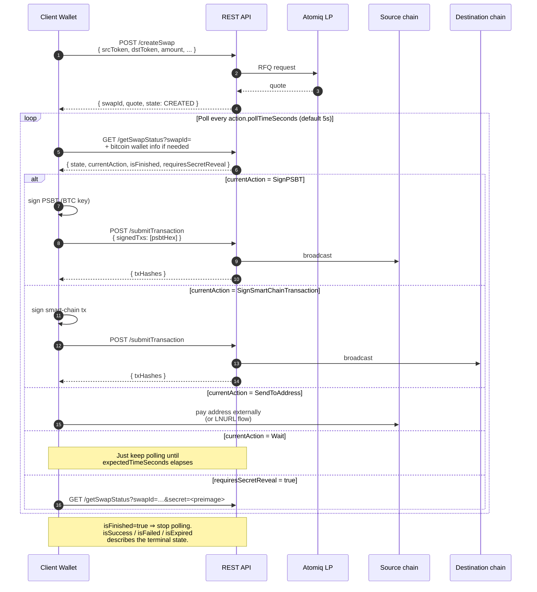

# Creating & Executing a Swap

This page covers the core swap lifecycle that every direction follows: **create → poll → sign → submit → repeat** until finished. Bitcoin- and Lightning-specific details (PSBT building, LNURL, preimage reveal) are split into [Bitcoin & Lightning Specifics](/rest-api-guide/bitcoin-and-lightning).

## Lifecycle overview



## 1. Create the swap

```bash
curl -X POST "http://localhost:3000/createSwap" \
  -H "Content-Type: application/json" \
  -d '{
    "srcToken":   "BITCOIN-BTC",
    "dstToken":   "STARKNET-STRK",
    "amount":     "150000",
    "amountType": "EXACT_IN",
    "dstAddress": "0x0123…"
  }'
```

Key fields:

| Field | Required | Notes |
|---|---|---|
| `srcToken`, `dstToken` | ✓ | Use the `<network>-<ticker>` IDs from [`getSupportedTokens`](/rest-api-guide/quoting). |
| `amount` | ✓ | Base units, encoded as a **decimal string** (see [Concepts → Amounts](/rest-api-guide/concepts#amounts-and-bigint-as-string)). |
| `amountType` | ✓ | `EXACT_IN` (fix source) or `EXACT_OUT` (fix destination). |
| `dstAddress` | ✓ | Destination address, BOLT11 invoice, or LNURL-pay link — depends on `dstToken`. |
| `srcAddress` | (✓ for smart → BTC/LN) | Smart-chain source address, or an LNURL-withdraw link when `srcToken = LIGHTNING-BTC`. |
| `gasAmount` | optional | Gas-drop: native destination-chain tokens to deliver alongside the swap. |
| `paymentHash` / `lightningInvoiceDescription` / `lightningInvoiceDescriptionHash` | optional | Lightning-specific overrides — see [Bitcoin & Lightning](/rest-api-guide/bitcoin-and-lightning). |

The response is a **swap record** — the same shape every subsequent `getSwapStatus` call will return:

```jsonc
{
  "swapId":   "…",
  "swapType": "FROM_BTC",
  "state":    { "number": 1, "name": "CREATED", "description": "…" },
  "quote":    {
    "inputAmount":  { "amount": "0.0015",      "rawAmount": "150000", ... },
    "outputAmount": { "amount": "4.21",        "rawAmount": "4210000000000000000", ... },
    "fees":         { "swap": { ... }, "networkOutput": { ... } },
    "expiry":       1713360000000,
    "outputAddress": "0x0123…"
  },
  "createdAt": 1713359700000,
  "steps":    [ /* SwapExecutionStep[] — see below */ ]
}
```

Persist `swapId` before asking the user to sign anything. It's the only handle for resuming a swap if the app restarts mid-flow.

## 2. Poll for the current action

Drive the swap forward by calling `GET /getSwapStatus` on each tick:

```bash
curl "http://localhost:3000/getSwapStatus?swapId=<id>&bitcoinAddress=<addr>&bitcoinPublicKey=<hex>"
```

Pass `bitcoinAddress` + `bitcoinPublicKey` on **every** call — the API needs them to build funded PSBTs for Bitcoin → smart-chain swaps. They're ignored for directions that don't need them.

The response extends the swap record with four boolean flags and a `currentAction`:

```jsonc
{
  /* ... all swap-record fields ... */
  "isFinished":       false,
  "isSuccess":        false,
  "isFailed":         false,
  "isExpired":        false,
  "currentAction":    { "type": "SignPSBT", /* ... */ },
  "requiresSecretReveal": false
}
```

When `isFinished === true`, stop polling. See [Concepts → Terminal states](/rest-api-guide/concepts#terminal-states).

## 3. Handle the current action

`currentAction` is one of four shapes. The wallet's job is a small switch:

| `type` | Wallet must… | Key fields |
|---|---|---|
| `SignPSBT` | Sign Bitcoin PSBTs. | `txs: [{ psbtHex, type, signInputs: number[] }]` |
| `SignSmartChainTransaction` | Sign chain-native transactions. | `chain: "SOLANA" \| "STARKNET" \| "BOTANIX" \| …`, `txs: string[]` |
| `SendToAddress` | Pay an address out of band (on-chain or Lightning). | `txs: [{ address, amount, name }]` |
| `Wait` | Do nothing, just poll. | `expectedTimeSeconds`, `pollTimeSeconds` |

`SendToAddress` and `Wait` need no follow-up call — the server will advance the state on its own as soon as the payment lands or the wait elapses. `SignPSBT` and `SignSmartChainTransaction` require a follow-up `submitTransaction`.

Details for each action type (especially PSBTs and LNURL) live in [Bitcoin & Lightning](/rest-api-guide/bitcoin-and-lightning).

## 4. Submit signed transactions

Send signed payloads back with `POST /submitTransaction`:

```bash
curl -X POST "http://localhost:3000/submitTransaction" \
  -H "Content-Type: application/json" \
  -d '{ "swapId": "…", "signedTxs": ["<hex>", "<hex>"] }'
```

Encoding rules per action type:

- **`SignPSBT`** → each `signedTxs[i]` is the **hex-encoded or base64-encoded signed PSBT**.
- **`SignSmartChainTransaction`** → format depends on `action.chain`:
  - **Solana** — hex-encoded serialized Solana transaction. Use `partialSign`; the LP may already have co-signed.
  - **Starknet** — JSON-stringified envelope `{ type, signed, details, ... }` as returned by the action, with a populated `signed` field.
  - **EVM** (Botanix / Citrea / Alpen / Goat) — hex-encoded Ethereum raw-transaction string.

Response:

```jsonc
{ "txHashes": ["0x…"] }
```

The reference implementation at [`scripts/process-swap.ts`](https://github.com/atomiqlabs/atomiq-api-docker/blob/main/scripts/process-swap.ts) in the Docker repo handles every per-chain signing variant and is the canonical source if the docs and code disagree.

## 5. Minimal client loop

The whole thing in pseudocode:

```ts
const { swapId } = await post("/createSwap", {
  srcToken, dstToken, amount, amountType, dstAddress,
});

for (;;) {
  const s = await get("/getSwapStatus", { swapId, bitcoinAddress, bitcoinPublicKey });
  if (s.isFinished) break;

  if (s.requiresSecretReveal) {
    await get("/getSwapStatus", { swapId, secret: preimageHex });
    continue;
  }

  const action = s.currentAction;
  let signedTxs;
  switch (action?.type) {
    case "SignPSBT":                  signedTxs = await signPSBTs(action.txs); break;
    case "SignSmartChainTransaction": signedTxs = await signSmartChain(action); break;
    case "SendToAddress":             showAddressToUser(action.txs[0]);         break;
    case "Wait":                      /* no-op */                               break;
  }
  if (signedTxs?.length) await post("/submitTransaction", { swapId, signedTxs });

  await sleep((action?.pollTimeSeconds ?? 5) * 1000);
}

// s.isSuccess / s.isFailed / s.isExpired describes the terminal state.
```

## Swap execution steps

Every swap record carries a `steps` array alongside the action-level state. `steps` is a **UX hint** describing the swap as a linear sequence of stages — good for rendering a progress strip. The *actionable* state still lives in `currentAction`.

| `type` | Meaning | Statuses |
|---|---|---|
| `Setup` | Destination-side setup (e.g. creating the destination HTLC / escrow). | `awaiting`, `completed`, `soft_expired`, `expired` |
| `Payment` | The user's payment that initiates or funds the swap on the source side. | `inactive`, `awaiting`, `received`, `confirmed`, `soft_expired`, `expired` |
| `Settlement` | Payout / settlement on the destination side. | `inactive`, `waiting_lp`, `awaiting_automatic`, `awaiting_manual`, `soft_settled`, `soft_expired`, `settled`, `expired` |
| `Refund` | Source-side refund path after a failed swap. | `inactive`, `awaiting`, `refunded` |

Bitcoin `Payment` steps also carry a `confirmations: { current, target, etaSeconds }` progress object once the funding transaction has been seen on-chain. Step objects expose `initTxId`, `settleTxId`, `setupTxId`, or `refundTxId` fields as the underlying transactions are broadcast — handy for linking into a block explorer.

```jsonc
// Example step — Bitcoin payment being confirmed
{
  "type":        "Payment",
  "side":        "source",
  "chain":       "BITCOIN",
  "title":       "Bitcoin deposit",
  "description": "Waiting for 3 block confirmations.",
  "status":      "received",
  "confirmations": { "current": 1, "target": 3, "etaSeconds": 1200 },
  "initTxId":    "a1b2…"
}
```

## What next?

- Handling Bitcoin-specific bits (PSBT inputs, fee rates), Lightning invoices, and LNURL settlement → [Bitcoin & Lightning Specifics](/rest-api-guide/bitcoin-and-lightning).
- Persisting state across app restarts, refunds, "needs your attention" UIs → [Managing Swaps](/rest-api-guide/managing-swaps).
