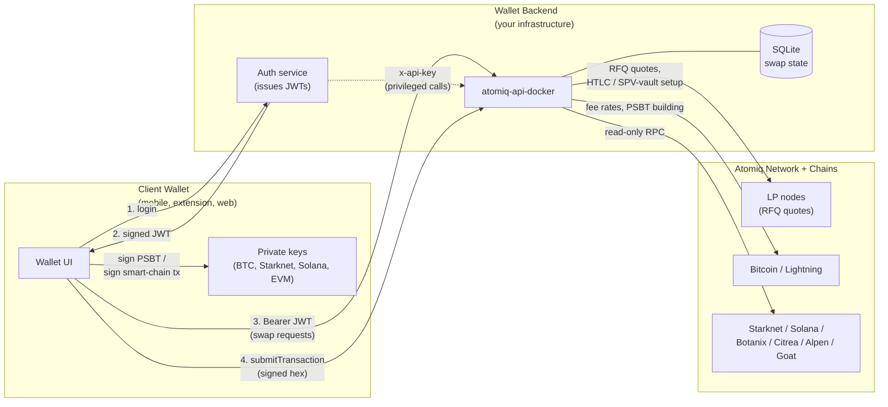

# REST API Guide

[`atomiq-api-docker`](https://github.com/atomiqlabs/atomiq-api-docker) is a dockerized HTTP API that wraps the Atomiq SDK's `SwapperApi` in an Express server. It exists so a wallet backend, frontend, or any other HTTP-speaking service can embed trustless swaps between **Bitcoin / Lightning** and smart chains (**Starknet, Solana, Botanix, Citrea, Alpen, Goat**) without pulling the full SDK into every mobile, extension, or web client.

This guide covers how to run, configure, and drive the service. For the exact request and response shapes of every endpoint, see the [REST API Reference](/api-reference/atomiq-sdk-swapper-api).

:::tip
- For the endpoint-level reference (paths, query parameters, request/response schemas), see the [REST API Reference](/api-reference/atomiq-sdk-swapper-api).
- For in-process usage from TypeScript instead of HTTP, see the [SDK Guide](/developers/).
- The source repository and helper scripts live at [`atomiqlabs/atomiq-api-docker`](https://github.com/atomiqlabs/atomiq-api-docker).
:::

## What This Service Is

`atomiq-api-docker` is a thin, stateful HTTP layer over the Atomiq SDK:

- Embeds one `SwapperApi` instance wired to all supported smart chains.
- Exposes HTTP endpoints for quoting, creating, listing, polling, and submitting swaps.
- Holds the local swap database (SQLite files mounted into the container) and keeps it in sync in the background.
- Provides API-key and JWT auth with per-path rate-limit overrides, so the same instance can serve both trusted backends and untrusted public clients.
- Supports HTTPS with hot certificate reload for direct TLS termination (e.g. certbot renewals).

### What It Is Not

- **Not a custodian.** Atomiq swaps are trustless HTLC / PSBT / SPV-vault flows — the API never holds user keys. All signing happens in the **client wallet**; the API only generates unsigned transactions and submits signed ones.
- **Not a liquidity provider.** Quotes come from the Atomiq LP network.
- **Not a UI.** It is a backend service. You build the wallet UX around it.

## System Architecture

The diagram below shows one representative deployment in which a wallet backend fronts the API for its own end users. This is not the only topology — the API can also be consumed directly by a frontend, by a standalone script, or by any other HTTP client that can sign transactions client-side.

| Party | Role |
|---|---|
| **Client wallet** | Holds keys. Signs PSBTs and smart-chain transactions. |
| **Wallet backend** | Issues JWTs to authenticated end users. Optionally calls the API with an API key for privileged flows. Hosts `atomiq-api-docker`. |
| **`atomiq-api-docker`** | Single stateful process that talks to Atomiq LPs and all chain RPCs, persists swap state, returns actions the client must sign. |

## Where Atomiq Liquidity Comes From

`atomiq-api-docker` is a client of the Atomiq LP network. It does **not** run an LP itself. When you call `createSwap`, the SDK:

1. Looks up registered LP nodes for the requested token pair.
2. Requests a quote (RFQ) from one or more of them.
3. Returns the best quote with fees and expiry.

If liquidity drops (LP goes offline, channel closes, etc.) the instance periodically reloads the LP list in the background.

## Next Steps

- **[Quick Start →](/rest-api/quick-start)** — run the service locally with Docker Compose.
- **[Configuration →](/rest-api/configuration)** — `config.yaml`, auth, rate limiting, HTTPS, reverse proxy.
- **[Swap Flow →](/rest-api/swap-flow)** — how to create and process swaps end-to-end.
