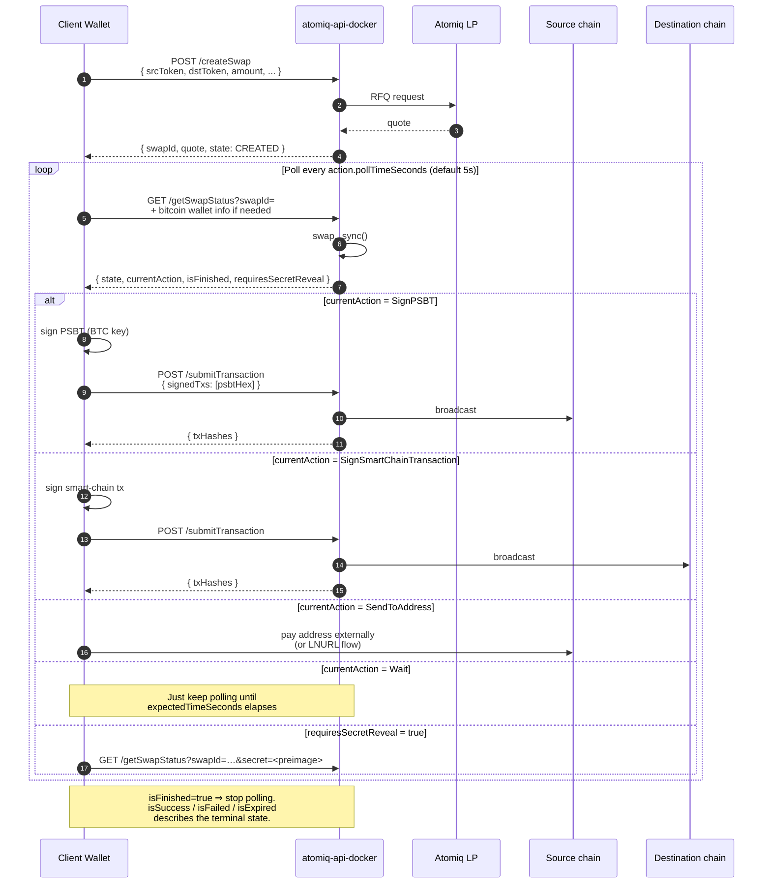

# Swap Flow

This page describes the end-to-end flow of creating and processing a swap over the HTTP API. For exact request and response schemas, see the [REST API Reference](/api-reference/atomiq-sdk-swapper-api).

## Token identifiers

Tokens are identified by the string `<network>-<ticker>`. Typical values:

- `BITCOIN-BTC` (on-chain Bitcoin)
- `LIGHTNING-BTC` (Lightning BTC)
- `STARKNET-STRK`, `STARKNET-ETH`, `STARKNET-<erc20-address>`
- `SOLANA-SOL`, `SOLANA-<spl-mint>`
- `CITREA-CBTC`, `BOTANIX-BTC`, etc.

Use `GET /getSupportedTokens` to enumerate what the current LP set supports.

## Lifecycle

Every direction follows the same shape: **create → poll → sign → submit → repeat** until finished.



## Minimal client loop (pseudocode)

```ts
const { swapId } = await post("/createSwap", {
  srcToken, dstToken, amount, amountType, dstAddress,
});

for (;;) {
  const s = await get("/getSwapStatus", { swapId, bitcoinAddress, bitcoinPublicKey });
  if (s.isFinished) break;

  if (s.requiresSecretReveal) {
    await get("/getSwapStatus", { swapId, secret: preimageHex });
    continue;
  }

  const action = s.currentAction;
  switch (action?.type) {
    case "SignPSBT":                  /* sign with BTC key */; break;
    case "SignSmartChainTransaction": /* sign per action.chain */; break;
    case "SendToAddress":             /* show address to user */; break;
    case "Wait":                      /* no-op */; break;
  }
  if (signedTxs) await post("/submitTransaction", { swapId, signedTxs });

  await sleep((action?.pollTimeSeconds ?? 5) * 1000);
}
```

`scripts/process-swap.ts` in the repo is the canonical reference implementation — it handles Solana `partialSign`, Starknet invoke vs. deploy-account, EVM raw transactions, PSBT input selection, and LNURL settlement.

## Swap execution steps

`steps` on the swap record is a UX hint that describes the swap as a linear sequence of stages the user progresses through. Each step declares which side of the swap it belongs to (`source` / `destination`), the relevant `chain`, a human-readable `title` / `description`, and a `status` that advances as the swap moves forward. Steps are best used to render a progress strip; the actionable state lives in `currentAction` returned by `getSwapStatus`.

| `type` | Meaning | Statuses |
|---|---|---|
| `Setup` | Destination-side setup required before the swap can continue (e.g. creating the destination HTLC / escrow). | `awaiting`, `completed`, `soft_expired`, `expired` |
| `Payment` | The user's payment that initiates or funds the swap on the source side. | `inactive`, `awaiting`, `received`, `confirmed`, `soft_expired`, `expired` |
| `Settlement` | Payout / settlement on the destination side. | `inactive`, `waiting_lp`, `awaiting_automatic`, `awaiting_manual`, `soft_settled`, `soft_expired`, `settled`, `expired` |
| `Refund` | Source-side refund path after a failed swap. | `inactive`, `awaiting`, `refunded` |

Bitcoin `Payment` steps additionally include a `confirmations: { current, target, etaSeconds }` progress object once the funding transaction has been seen on-chain. All step objects carry `initTxId`, `settleTxId`, `setupTxId`, or `refundTxId` fields as the relevant transactions are broadcast — convenient to link into a block explorer.

## Action types returned by `getSwapStatus`

`currentAction` is one of (all common fields: `type`, `name`, `pollTimeSeconds`):

| `type` | Wallet must… | Key fields |
|---|---|---|
| `SignPSBT` | Sign Bitcoin PSBTs. | `txs: [{ psbtHex, type, signInputs: number[] }]` |
| `SignSmartChainTransaction` | Sign chain-native transactions. | `chain: "SOLANA" \| "STARKNET" \| "BOTANIX" \| ...`, `txs: string[]` (chain-specific envelope) |
| `SendToAddress` | Pay an address out of band (usually BTC / Lightning). | `txs: [{ address, amount, name }]` |
| `Wait` | Do nothing, just poll. | `expectedTimeSeconds` |

Pass the client's BTC `bitcoinAddress` + `bitcoinPublicKey` on every `/getSwapStatus` call — the API needs them to build funded PSBTs for the Bitcoin → smart-chain direction.

### Submitting signed transactions

Submit via `POST /submitTransaction`:

```jsonc
{ "swapId": "…", "signedTxs": ["<hex>", "<hex>"] }
```

Per-action encoding rules:

- **SignPSBT** → each `signedTxs[i]` is the hex-encoded or base64-encoded signed PSBT.
- **SignSmartChainTransaction** → format depends on the chain:
  - **Solana**: hex-encoded serialized Solana transaction (use `partialSign`, the LP may already have co-signed).
  - **Starknet**: JSON-stringified envelope (`{ type, signed, details, ... }`) as returned by the action, with a populated `signed` field.
  - **EVM** (Botanix / Citrea / Alpen / Goat): hex-encoded Ethereum raw-transaction string.

Response:

```jsonc
{ "txHashes": ["0x…"] }
```

See `scripts/process-swap.ts` for a full per-chain signing reference implementation.

## Lightning and LNURL

Two ways to handle LNURL links:

### a) Recommended: client-side LNURL resolution

Prefer resolving LNURLs on the client (wallet UI) and passing the resulting Lightning invoice / payee info to `/createSwap`. This minimizes the trust the client places on the middleware: the API never sees a link that, if replaced, could redirect funds.

### b) Supported: pass LNURLs directly

You can pass an LNURL-withdraw link as `srcAddress` (for `LIGHTNING-BTC → *`) or an LNURL-pay link as `dstAddress` (for `* → LIGHTNING-BTC`) — the SDK resolves them internally, which implies you trust the API server to resolve them properly.

### Preimage reveal

For `LIGHTNING-BTC → smart-chain` flows, the client usually generates a random 32-byte preimage and passes `paymentHash = sha256(preimage)` into `/createSwap`. When `/getSwapStatus` returns `requiresSecretReveal: true`, the client reveals the preimage by calling `/getSwapStatus?swapId=…&secret=<hex>`. The API then broadcasts this secret over Nostr to allow for automatic settlement, or uses it to generate settlement transactions which are returned to the user for signing.
